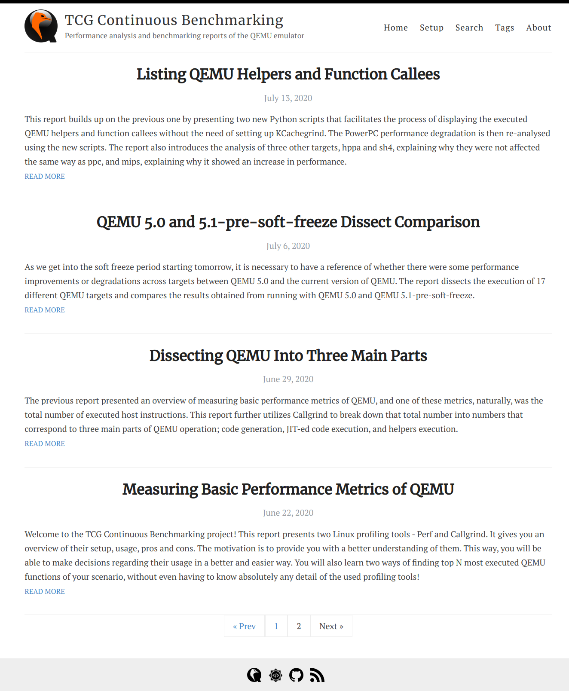

## TCG Continuous Benchmarking

  

[TCG Continuous Benchmarking](https://summerofcode.withgoogle.com/projects/#5636539490500608) is the QEMU project for Google Summer of Code 2020 which offers an in depth exploratory performance analysis and benchmarking for the QEMU emulator using the TCG JIT in both its Linux user and system modes.

This repository presents all of the work done throughout the project.

---

### Performance Analysis Reports and Tools

A [dedicated website](https://ahmedkrmn.github.io/TCG-Continuous-Benchmarking/) was built to host the weekly analysis reports of the project. Each report tackled a specific topic and introduced all the tools, procedures and methodologies to achieve the required results.

The website offers a [Search page](https://ahmedkrmn.github.io/TCG-Continuous-Benchmarking/search) for searching the reports for a specific phrase, a [Tags page](https://ahmedkrmn.github.io/TCG-Continuous-Benchmarking/search) for viewing the reports per tag, and a [Setup page](https://ahmedkrmn.github.io/TCG-Continuous-Benchmarking/setup/) that shows the testbed hardware information and all the required setup procedures.

  

**Submitted Reports:**

- [Report 1 - Measuring Basic Performance Metrics of QEMU](https://ahmedkrmn.github.io/TCG-Continuous-Benchmarking/Measuring-Basic-Performance-Metrics-of-QEMU/)

  The first report of the TCG Continuous Benchmarking project presents two Linux profiling tools - Perf and Callgrind. It gives an overview of their setup, usage, pros and cons. The motivation is to provide a better understanding of them. This way, you will be able to make decisions regarding their usage in a better and easier way. You will also learn two ways of finding top N most executed QEMU functions of your scenario, without even having to know absolutely any detail of the used profiling tools!

  - **Tools:** [topN_perf.py](https://github.com/ahmedkrmn/TCG-Continuous-Benchmarking/tree/master/tools/topN_perf) and [topN_callgrind.py](https://github.com/ahmedkrmn/TCG-Continuous-Benchmarking/tree/master/tools/topN_callgrind)

- [Report 2 - Dissecting QEMU Into Three Main Parts](https://ahmedkrmn.github.io/TCG-Continuous-Benchmarking/Dissecting-QEMU-Into-Three-Main-Parts/)

  The previous report presented an overview of measuring basic performance metrics of QEMU, and one of these metrics, naturally, was the total number of executed host instructions. This report further utilizes Callgrind to break down that total number into numbers that correspond to three main parts of QEMU operation; code generation, JIT-ed code execution, and helpers execution.

  - **Tools:** [dissect.py](https://github.com/ahmedkrmn/TCG-Continuous-Benchmarking/tree/master/tools/dissect_qemu_instructions)

- [Report 3 - QEMU 5.0 and 5.1-pre-soft-freeze Dissect Comparison](https://ahmedkrmn.github.io/TCG-Continuous-Benchmarking/QEMU-5.0-and-5.1-pre-soft-freeze-Dissect-Comparison/)

  As we get into the soft freeze period starting July 7th, it is necessary to have a reference of whether there were some performance improvements or degradations across targets between QEMU 5.0 and the current version of QEMU. The report dissects the execution of 17 different QEMU targets and compares the results obtained from running with QEMU 5.0 and QEMU 5.1-pre-soft-freeze.

- [Report 4 - Listing QEMU Helpers and Function Callees](https://ahmedkrmn.github.io/TCG-Continuous-Benchmarking/Listing-QEMU-Helpers-and-Function-Callees/)

  This report builds up on the previous one by presenting two new Python scripts that facilitates the process of displaying the executed QEMU helpers and function callees without the need of setting up KCachegrind. The PowerPC performance degradation is then re-analysed using the new scripts. The report also introduces the analysis of three other targets, hppa and sh4, explaining why they were not affected the same way as ppc, and mips, explaining why it showed an increase in performance.

  - **Tools:** [list_helpers.py](https://github.com/ahmedkrmn/TCG-Continuous-Benchmarking/tree/master/tools/list_helpers_and_fn_callees) and [list_fn_callees.py](https://github.com/ahmedkrmn/TCG-Continuous-Benchmarking/tree/master/tools/list_helpers_and_fn_callees)

- [Report 5 - Finding Commits Affecting QEMU Performance](https://ahmedkrmn.github.io/TCG-Continuous-Benchmarking/Finding-Commits-Affecting-QEMU-Performance/)

  This report concludes a mini series of three reports that presented a comparison between QEMU 5.0 and QEMU 5.1-pre-soft-freeze. The first report in the series presented the comparison results as well as an analysis of the performance degradation introduced in the PowerPC targets using KCachegrind. The second report presented two new scripts for inspecting performance changes as well as the analysis of three other targets. Now it's time to find the commits responsible for the performance changes discussed in the two previous reports. This report provides a new tool for performing the process of locating those commits automatically.

  - **Tools:** [bisect.py](https://github.com/ahmedkrmn/TCG-Continuous-Benchmarking/tree/master/tools/bisect)

- [Report 6 - Performance Comparison of Two QEMU Builds (Compilers and QEMU Performance)](https://ahmedkrmn.github.io/TCG-Continuous-Benchmarking/Performance-Comparison-of-Two-QEMU-Builds/)

  This report presents a performance comparison between two different QEMU builds, GCC and Clang. To provide a variety of test workloads, five new benchmarks are also introduced in the report. For each benchmark, the performance of QEMU is compared across the GCC and Clang builds for seventeen different targets.

- [Report 7 - Measuring QEMU Emulation Efficiency](https://ahmedkrmn.github.io/TCG-Continuous-Benchmarking/Measuring-QEMU-Emulation-Efficiency/)

  In this report, a method for measuring the TCG emulation efficiency of QEMU is presented. This is achieved for seventeen different targets by comparing the number of guest instructions (running the program natively on the target) and the number of QEMU instructions (running the program through QEMU). For each target, the ratio between these two numbers presents a rough estimation of the emulation efficiency for that target.

- [Report 8 - QEMU Nightly Performance Tests](https://ahmedkrmn.github.io/TCG-Continuous-Benchmarking/QEMU-Nightly-Performance-Tests/)

  QEMU currently lacks a system for measuring the performance of targets automatically. The previous reports introduced different tools and methods for locating performance regressions, but all of them had to be manually executed by the user when needed. This report presents a new nightly tests system that runs automatically each night. After the execution is completed, it sends a report to the QEMU mailing list with the performance measurements of seventeen different QEMU targets, and how these measurements compare to previously obtained ones.

  - **Tools:** [Nightly Tests System](https://github.com/ahmedkrmn/TCG-Continuous-Benchmarking/tree/master/tools/qemu_nightly_tests)

- [Report 9 - Measuring QEMU Performance in System Mode](https://ahmedkrmn.github.io/TCG-Continuous-Benchmarking/Measuring-QEMU-Performance-in-System-Mode/)

  The final report of the TCG Continuos Benchmarking project introduces basic performance measurements for QEMU system mode emulation. Boot-up time and number of executed instructions are compared for the emulation of five different targets when booting Debian 10.5. The report also presents a new tool for finding the topN most executed functions in the emulation process.

  - **Tools:** [topN_system.py](https://github.com/ahmedkrmn/TCG-Continuous-Benchmarking/tree/master/tools/topN_system)

- [Report 10 - Measuring QEMU Performance in System Mode - Part Two](https://ahmedkrmn.github.io/TCG-Continuous-Benchmarking/Measuring-QEMU-Performance-in-System-Mode-Part-Two/)

  In part two of the final TCG Continuous Benchmarking report, the same procedures introduced in part one are used for inspecting the performance of QEMU system mode emulation. The only difference is instead of emulating the same OS for all targets, different images where selected from a Qemu-devel thread and the official QEMU documentation.

---

### Experiments

The month before the project was spent on collecting benchmarking and analysis data on QEMU performance. The following is the list of tools used in these experiments.

- [Build and Profile Benchmarks](https://github.com/ahmedkrmn/TCG-Continuous-Benchmarking/tree/master/experiments/build_and_profile_benchmarks)
- [LIBM Test](https://github.com/ahmedkrmn/TCG-Continuous-Benchmarking/tree/master/experiments/libm_test)

---

### List of Submitted Patches and Bugs

**Patches:**

- [[PATCH 0/2] Update use_goto_tb() in hppa and rx targets](https://www.mail-archive.com/qemu-devel@nongnu.org/msg704950.html)
  - [[PATCH 1/2] target/hppa: Check page crossings in use_goto_tb() only in system mode](https://www.mail-archive.com/qemu-devel@nongnu.org/msg704952.html)
  - [[PATCH 2/2] target/rx: Check for page crossings in use_goto_tb()](https://www.mail-archive.com/qemu-devel@nongnu.org/msg704951.html)
- [[PATCH v2 0/1] Check for page crossings in use_goto_tb() for rx target](https://www.mail-archive.com/qemu-devel@nongnu.org/msg708098.html)
  - [[PATCH v2 1/1] target/rx: Check for page crossings in use_goto_tb()](https://www.mail-archive.com/qemu-devel@nongnu.org/msg708099.html)
- [[PATCH 0/3] Add Scripts for Finding Top 25 Executed Functions](https://www.mail-archive.com/qemu-devel@nongnu.org/msg713035.html)
  - [[PATCH 1/3] MAINTAINERS: Add 'Miscellaneous' section](https://www.mail-archive.com/qemu-devel@nongnu.org/msg713036.html)
  - [[PATCH 2/3] scripts/performance: Add callgrind_top_25.py script](https://www.mail-archive.com/qemu-devel@nongnu.org/msg713037.html)
  - [[PATCH 3/3] scripts/performance: Add perf_top_25.py script](https://www.mail-archive.com/qemu-devel@nongnu.org/msg713038.html)
- [[PATCH v2 0/3] Add Scripts for Finding Top 25 Executed Functions](https://www.mail-archive.com/qemu-devel@nongnu.org/msg714310.html)
  - [[PATCH v2 1/3] scripts/performance: Add topN_perf.py script](https://www.mail-archive.com/qemu-devel@nongnu.org/msg714309.html)
  - [[PATCH v2 2/3] scripts/performance: Add topN_callgrind.py script](https://www.mail-archive.com/qemu-devel@nongnu.org/msg714312.html)
  - [[PATCH v2 3/3] MAINTAINERS: Add 'Performance Tools and Tests' subsection](https://www.mail-archive.com/qemu-devel@nongnu.org/msg714314.html)
- [[PATCH v3 0/3] Add Scripts for Finding Top 25 Executed Functions](https://www.mail-archive.com/qemu-devel@nongnu.org/msg716011.html)
  - [[PATCH v3 1/3] scripts/performance: Add topN_perf.py script](https://www.mail-archive.com/qemu-devel@nongnu.org/msg716010.html)
  - [[PATCH v3 2/3] scripts/performance: Add topN_callgrind.py script](https://www.mail-archive.com/qemu-devel@nongnu.org/msg716014.html)
  - [[PATCH v3 3/3] MAINTAINERS: Add 'Performance Tools and Tests' subsection](https://www.mail-archive.com/qemu-devel@nongnu.org/msg716013.html)
- [[PATCH v4 0/3] Add Scripts for Finding Top 25 Executed Functions](https://www.mail-archive.com/qemu-devel@nongnu.org/msg717095.html)
  - [[PATCH v4 1/3] scripts/performance: Add topN_perf.py script](https://www.mail-archive.com/qemu-devel@nongnu.org/msg717097.html)
  - [[PATCH v4 2/3] scripts/performance: Add topN_callgrind.py script](https://www.mail-archive.com/qemu-devel@nongnu.org/msg717094.html)
  - [[PATCH v4 3/3] MAINTAINERS: Add 'Performance Tools and Tests' subsection](https://www.mail-archive.com/qemu-devel@nongnu.org/msg717099.html)
- [[PATCH 0/1] Add Script for Dissecting QEMU Execution](https://www.mail-archive.com/qemu-devel@nongnu.org/msg718461.html)
  - [[PATCH 1/1] scripts/performance: Add dissect.py script](https://www.mail-archive.com/qemu-devel@nongnu.org/msg718462.html)
- [[PATCH v2 0/1] Add Script for Dissecting QEMU Execution](https://www.mail-archive.com/qemu-devel@nongnu.org/msg719000.html)
  - [[PATCH v2 1/1] scripts/performance: Add dissect.py script](https://www.mail-archive.com/qemu-devel@nongnu.org/msg718999.html)
- [[PATCH v3 0/1] Add Script for Dissecting QEMU Execution](https://www.mail-archive.com/qemu-devel@nongnu.org/msg721457.html)
  - [[PATCH v3 1/1] scripts/performance: Add dissect.py script](https://www.mail-archive.com/qemu-devel@nongnu.org/msg721458.html)
- [[PATCH 0/2] Add list_fn_callees.py and list_helpers.py scripts](https://www.mail-archive.com/qemu-devel@nongnu.org/msg723083.html)
  - [[PATCH 1/2] scripts/performance: Add list_fn_callees.py script](https://www.mail-archive.com/qemu-devel@nongnu.org/msg723086.html)
  - [[PATCH 2/2] scripts/performance: Add list_helpers.py script](https://www.mail-archive.com/qemu-devel@nongnu.org/msg723089.html)
- [[PATCH v2 0/2] Add list_fn_callees.py and list_helpers.py scripts](https://www.mail-archive.com/qemu-devel@nongnu.org/msg723519.html)
  - [[PATCH v2 1/2] scripts/performance: Add list_fn_callees.py script](https://www.mail-archive.com/qemu-devel@nongnu.org/msg723518.html)
  - [[PATCH v2 2/2] scripts/performance: Add list_helpers.py script](https://www.mail-archive.com/qemu-devel@nongnu.org/msg723520.html)
- [[PATCH 0/1] Add bisect.py script](https://www.mail-archive.com/qemu-devel@nongnu.org/msg724526.html)
  - [[PATCH 1/1] scripts/performance: Add bisect.py script](https://www.mail-archive.com/qemu-devel@nongnu.org/msg724527.html)
- [[PATCH 0/9] GSoC 2020 - TCG Continuous Benchmarking scripts and tools](https://www.mail-archive.com/qemu-devel@nongnu.org/msg734487.html)
  - [[PATCH 1/9] scripts/performance: Refactor topN_perf.py](https://www.mail-archive.com/qemu-devel@nongnu.org/msg734489.html)
  - [[PATCH 2/9] scripts/performance: Refactor topN_callgrind.py](https://www.mail-archive.com/qemu-devel@nongnu.org/msg734492.html)
  - [[PATCH 3/9] scripts/performance: Refactor dissect.py](https://www.mail-archive.com/qemu-devel@nongnu.org/msg734488.html)
  - [[PATCH 4/9] scripts/performance: Add list_fn_callees.py script](https://www.mail-archive.com/qemu-devel@nongnu.org/msg734486.html)
  - [[PATCH 5/9] scripts/performance: Add list_helpers.py script](https://www.mail-archive.com/qemu-devel@nongnu.org/msg734490.html)
  - [[PATCH 6/9] scripts/performance: Add bisect.py script](https://www.mail-archive.com/qemu-devel@nongnu.org/msg734493.html)
  - [[PATCH 7/9] tests/performance: Add nightly tests](https://www.mail-archive.com/qemu-devel@nongnu.org/msg734495.html)
  - [[PATCH 8/9] MAINTAINERS: Add 'tests/performance' to 'Performance Tools and Tests' subsection](https://www.mail-archive.com/qemu-devel@nongnu.org/msg734494.html)
  - [[PATCH 9/9] scripts/performance: Add topN_system.py script](https://www.mail-archive.com/qemu-devel@nongnu.org/msg734491.html)

**Bugs:**

- [#1880722 Problems related to checking page crossing in use_goto_tb()](https://bugs.launchpad.net/qemu/+bug/1880722)
- [#1880763 Missing page crossing check in use_goto_tb() for rx target](https://bugs.launchpad.net/qemu/+bug/1880763)
- [#1892081 Performance improvement when using "QEMU_FLATTEN" with softfloat type conversions](https://bugs.launchpad.net/qemu/+bug/1892081)
