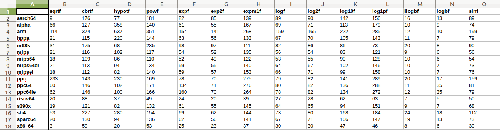

## Testing LIBM in QEMU

This test system measures the performance of emulation of `libm` math functions under QEMU by comparing the number of executed instructions on seventeen different targets. It measures the wall clock time of execution of 90 math functions where each function is executed for `i` iterations.

The comparison results are exported to an excel sheet.

### Test Structure

**math.c**:

The main C file for benchmarking the math library. The file expects 3 arguments to execute:

- `-i` : The number of iterations (required)

- `-f` : A single function to test (optional - default is all functions)

- `-t` : Datatype to test (optional - default is all data types: float, double & longfloat)

**extract_data.py:**

The python scripts that extracts the data from the output of running QEMU on all the selected targets and saving the results in a spreadsheet. Please make sure that you install the required pip packages found in "requirements.txt".

**function_domains.xls:**

A spreadsheet containing the domain of all functions in the math library. This spreadsheet will be appended to the newly exported benchmarking spreadsheet from running the Python script.

**benchmark.sh:**

The entry point of running the complete benchmark.

The script has three options defined at the top of the script, these options should be set by the user before running the script, the options are:

1. `QEMU_BUILD`: The absolute path to the qemu build

2. `ARGS`: The cmd arguments that should be passed to the math.c file

3. `TARGET_COMPILERS`: An array of the target compilers that the user wants to test

After executing the script, the results spreadsheet file will be added to the directory.

- math-measurements.ods

All intermediate files are stored in the following directories, they are deleted at the end of the execution of the shell script.

1. executables

2. output

### Results

[https://drive.google.com/drive/folders/1bbVlk1KV2cxzGK4-YGPPUW2W5WilO9gi](https://drive.google.com/drive/folders/1bbVlk1KV2cxzGK4-YGPPUW2W5WilO9gi)
